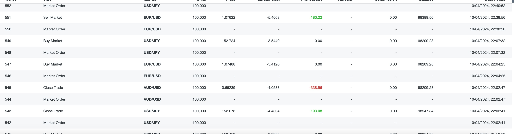
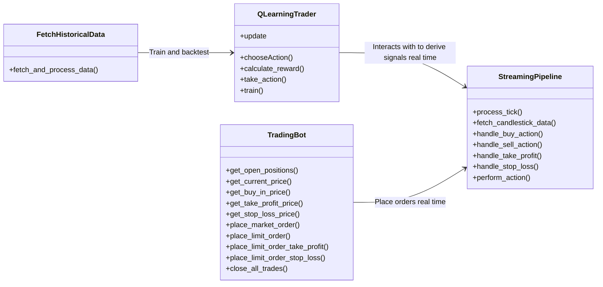
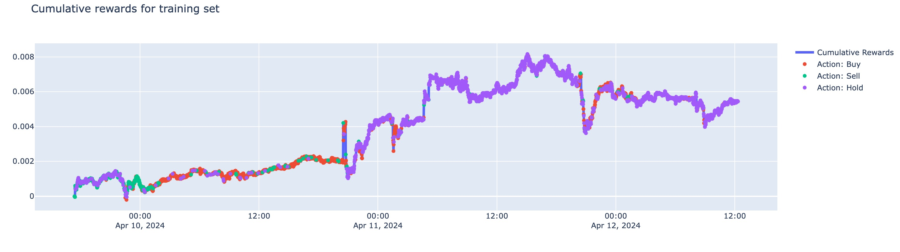
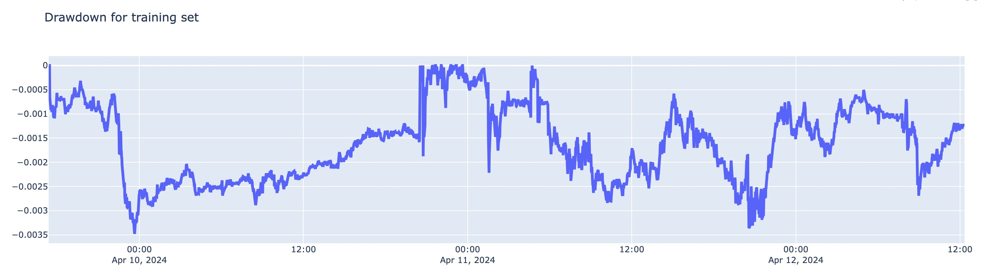

# QTraderFX

 
 

QTraderFX is an algorithmic trading project that implements a Q-learning based trading strategy. It operates and interacts with the forex market using minute-interval data fetched from OANDA's API with a time-based exit. This is a work in progress project. Currently it only supports a subset of currency pairs and limited to long positions only.

 

<u>**Screenshot of trading history**</u>
 

 

## Rationale
<u>The reasons for moving away from traditional ML to generate signals are as follow:</u>

- The market is non-stationary. The current goodness of fit of the model does not indicate future trend. **Data/Concept drifts** occur way too often for the signals generated from traditional ML to be meaningful.Deciding when and how often to **retrain** machine learning models can be complex. Frequent retraining might be necessary to keep up with the rapid changes in financial markets, but it can be **resource-intensive and disruptive**. Moreover, determining the optimal time to retrain requires robust monitoring systems and can still be subject to errors if the market changes unexpectedly or abruptly
- In higher frequency trading environment. There are way **more noise than actual signals**. The likelihood of **overfitting** on noise is extremely high.
- The effectiveness of indicators that provide **explanatory power** for feature extraction can fluctuate and **may not remain consistent over time**.
- Metrics for traditional ML may not translate to profitable trading strategy.
- Reinforcement learning and other more sophisticated techniques that can adapt to changing environments and consider the **sequential nature** of decision-making

 

## High Level Workflow Diagram

## How Q-Learning works

**Q-value Update Formula**:
- `Q(s, a) = (1 - alpha) * Q(s, a) + alpha * (r + gamma * max_a' Q(s', a'))`

Where:
- `Q(s, a)` is the Q-value for the specific state-action pair.
- `alpha` is the learning rate, indicating how significantly new information should adjust the existing Q-value.
- `r` is the reward received after performing action `a` in state `s`.
- `gamma` is the discount factor, assessing the importance of future rewards.ß
- `max_a' Q(s', a')` represents the highest predicted Q-value for the next state `s'`, across all possible actions `a'`.

 

1. **Initialization of Q-table**: At the start, the Q-table is initialized as a zero matrix. This table has rows representing different possible actions (`Buy`, `Sell`, and `Hold`) and columns representing features of the trading environment. The values in the Q-table represent the agent's estimations of the expected cumulative rewards for taking a specific action in a specific state. The features selected in our case are `OHLC`, `SMA`, `RSI`, `MACD`, `Stochastic Oscillator`, `Support` and `Resistance`.

2. **Action Selection**: The action recommended at each time step is influenced by the exploration-exploitation trade-off. With a certain probability, the agent may decide to explore by generating a random action. Alternatively, it may opt to exploit its existing knowledge by choosing the action associated with the highest Q-value in the current state.

3. **Reward Calculation**: The reward is calculated based on the action taken and the closing price at the next time step. This reward reflects the success of the action according to the market's response.

4. **Q-value Update**: The Q-value for the action taken in the current state is updated using the reward information and the discounted maximum Q-value of the next state. This is done using the formula shown on top

5. **Iteration**: This process is repeated for each time step, continually updating the Q-table and refining the policy until the algorithm converges or a predefined number of episodes are completed.

6. **Cumulative Rewards**: After each action taken by the agent (such as Buy, Sell, or Hold), a reward is assigned based on the outcome. The cumulative reward is the sum of all rewards received from the beginning of an episode to its end. This total reflects the overall effectiveness of the policy being executed by the agent during that episode. Tracking cumulative rewards helps in fine-tuning the parameters of the Q-learning model, such as the learning rate (α) and the discount factor (γ).

**A sample Q-table:**

| Action | Feature 1 | Feature 2 | Feature 3 | Feature 4 | Feature 5 | Feature 6 | Feature 7 | Feature 8 | Feature 9 | Feature 10 | Feature 11 |
|--------|-----------|-----------|-----------|-----------|-----------|-----------|-----------|-----------|-----------|------------|------------|
|   0    |    0.0    |    0.0    |    0.0    |    0.0    |    0.0    | 8.6359e-05|    0.0    | 4.0521e-04| 4.5027e-04|    0.0     |    0.0     |
|   1    |    0.0    |    0.0    |    0.0    |    0.0    |    0.0    | 5.0669e-05|    0.0    | 1.2232e-04| 2.3010e-04|    0.0     |    0.0     |
|   2    |    0.0    |    0.0    |    0.0    |    0.0    |    0.0    | 3.2832e-04|    0.0    | 6.2920e-04| 7.2843e-04|    0.0     |    0.0     |

## Backtesting Result
- The sample backtesting results are available in `./notebooks/backtesting.ipynb`.
- We retrieve the latest 5000 data points and apply an `80-20 train-test split`.
- The Q-Learning Agent uses the feature states to determine the recommended action at each time step.
- The reward function operates as follows:
- Calculate price_change as `(next_close - current_close) / current_close`.
  - `price_change = (next_close - current_close) / current_close`
  - `if action == buy: return price change`
  - `if action == sell: return -price change`
  - `else: return price change`
In the test phase, to `mimic real-time streaming data`, the agent updates its state, action, and values sequentially for each data point (row).
 

 

## Limitation and Area for Improvement
- Q-Learning typically does not consider **capital limitations** and assumes the user has unlimited capital to trade which may not be realistic enough to gauge how profitable a strategy is
- The standard implementation of Q-Learning does not account for **position sizing**, which is crucial in trading for managing risk and optimizing returns. The user has to manually set stop loss and take profit threshold based on indicators and entry prices
- The Algorithm does not take into account of **transaction cost** and **slippage cost** which negatively affects the profitabiltiy
- There is a **lack of inherent uptrend** in general, therefore, buying and waiting for currencies to rise can potentially miss out on profitable opportunities that arise from currencies weakening
- The automation can never fully replace the human in the loop part because of the inability to observe and foresee macroeconomic events such as war, release of CPI news

## References:
https://oanda-api-v20.readthedocs.io  
https://github.com/AminHP/gym-anytrading/tree/master  
https://stable-baselines.readthedocs.io/en/master/modules/a2c.html  
https://www.sciencedirect.com/topics/engineering/q-learning
https://www.youtube.com/watch?v=D9sU1hLT0QY&t=1s

