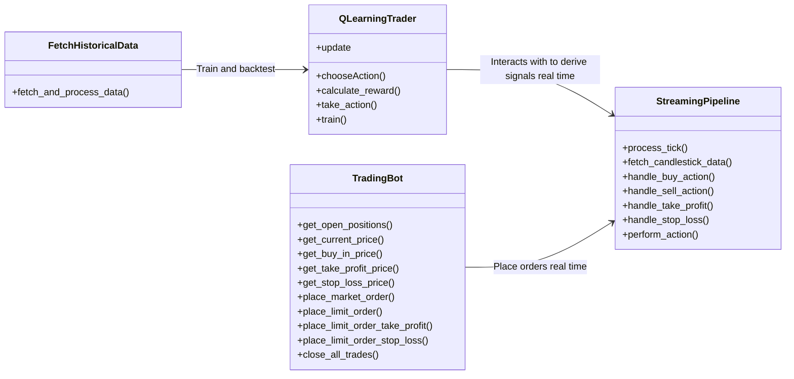

# QTraderFX

 
 

QTraderFX is an algorithmic trading project that implements a Q-learning based trading strategy. It operates and interacts with the forex market using minute-interval data fetched from OANDA's API. This is a work in progress project. Currently it only supports a subset of currency pairs and limited to long positions only.

 

## High Level Workflow Diagram

## Features
Utilizes Q-learning algorithm for decision-making in trading.
Trades on the forex market with minute-interval data.
Designed for use with OANDA brokerage.

#### References:
https://oanda-api-v20.readthedocs.io  
https://github.com/AminHP/gym-anytrading/tree/master  
https://stable-baselines.readthedocs.io/en/master/modules/a2c.html  
